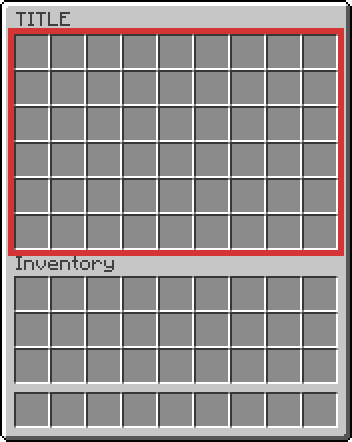
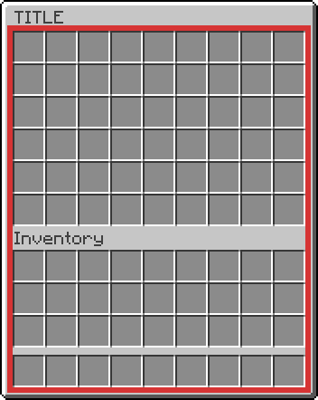
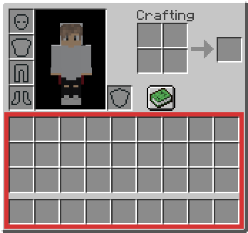
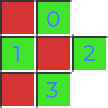
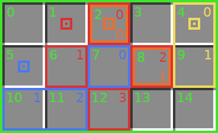

<p align="center">
    
</p>

<h3 align="center"> A library for creating component-based animated Minecraft inventory GUIs.</h3>

---

Das Ziel dieses Projektes ist es, GUIs möglichst einfach erstellen zu können.
Dabei wird großer Wert darauf gelegt, dass auch komplexe GUIs (z.B. mit Animationen)
unterstützt werden.
Die grundlegende Komponenten-Struktur ermöglicht es, einzelne Komponenten
in verschiedenen GUIs wiederzuverwenden und aus externen Quellen zu beziehen.
Dies führt zu einem stark reduzierten Aufwand, da häufig verwendete GUI-Strukturen
(z.B. Listen mit mehreren Seiten) nicht immer erneut programmiert werden müssen.

## Oberflächen-Typen

Die GUI kann auf verschiedenen Oberflächen angezeigt werden.
Momentan werden drei Oberflächen in Minecraft-Inventaren unterstützt.

### ChestInventory

Dies ist die wahrscheinlich populärste Oberfläche.
Sie besteht aus dem Inventar einer Kiste
und kann eine bis sechs Zeilen groß sein.
Unter ihr wird das aktuelle Spieler-Inventar angezeigt.
Dieses gehört allerdings nicht zu der Oberfläche
und die Nutzung davon kann deaktiviert werden.



### MergedInventory

Diese Oberfläche verbindet das [ChestInventory](#chestinventory) mit dem
darunterliegenden [PlayerInventory](#playerinventory).
Alle zuvor im Spieler-Inventar vorhandenen Items werden beim Öffnen des GUI entfernt
und beim Schließen wiederhergestellt.



### PlayerInventory

Diese Oberfläche besteht aus dem Spieler-Inventar des Spielers und besitzt vier Zeilen.
Alle zuvor im Inventar vorhandenen Items werden beim Öffnen des GUI entfernt
und beim Schließen wiederhergestellt.



## Komponenten

Alle Elemente des GUI bestehen aus Komponenten.
Komponenten als Ganzes können wiederum als Unterkomponenten in
andere Komponenten eingefügt werden.
Komponenten können jegliche Form annehmen
und auch nicht miteinander zusammenhängende Slots besitzen.
Der Index einer Komponente verläuft immer von der obersten Zeile nach unten
und jeweils pro Zeile von links nach rechts.

### ReservedSlots

ReservedSlots legen fest, wie Komponenten im Zweidimensionalen aufgebaut sind.
Dafür wird ein zweidimensionales Array an booleans benutzt.
Jeder boolean, welcher true ist, markiert einen Slot, welcher der Komponente zugehörig ist.
Jeder boolean, welcher auf false gesetzt wurde, gehört wiederum nicht zu
der Komponente und dient als Abstandshalter für einen zugehörigen Slot.

Dieses Beispiel zeigt die ReservedSlots der roten Komponente aus dem Beispiel
von [Verschachtelung](#verschachtelung).



 ReservedSlots -> true <br>
 ReservedSlots -> false <br>
 Index der Komponente

Die ReservedSlots dieser Komponente:

```
[
    [false, true],
    [true, false, true],
    [false, true]
]
```

### Verschachtelung

Komponenten können Unterkomponenten jeglicher Form enthalten,
solange alle ReservedSlots der Unterkomponente auch in der eigentlichen Komponente reserviert sind.
Jede Komponente besitzt dabei einen eigenen Index,
welcher sich über alle in der Komponente reservierten Slots erstreckt.

Dieses Beispiel zeigt eine Komponente (grün), welche einige Unterkomponenten besitzt.
Dazu werden in den jeweiligen Farben der Komponenten die Indizes aller Komponenten angegeben.



 Abgrenzung der Komponente einer Farbe<br>
 Index der Komponente einer Farbe<br>
 [Start-Index](#start-index) der Komponente einer Farbe

#### Start-Index

Um eine Unterkomponente einzufügen, wird ein Start-Index benötigt,
welcher als Ankerpunkt der Unterkomponente auf der übergeordneten Komponente dient.
Auf dem angegebenen Start-Index liegt der erste Eintrag der [ReservedSlots](#reservedslots).
Es macht dabei keinen Unterschied, ob der erste Eintrag reserviert ist, oder nicht.

Generell kann sich gemerkt werden: Wenn man um die ganze Komponente ein Rechteck zieht,
ist der Start-Index immer der Slot oben links in der Ecke.

### Item-Component

Die [ItemComponent](./src/main/kotlin/net/bestlinuxgamers/guiApi/component/essentials/ItemComponent.kt)
ist eine Komponente, welche einen Minecraft-ItemStack abbildet.
Sie muss benutzt werden, um einzelne Items in die Komponenten-Struktur einzubringen.


### Component-Tick

Der Component-Tick ist eine periodische Routine, welche den Aufruf der
[GuiComponent](./src/main/kotlin/net/bestlinuxgamers/guiApi/component/GuiComponent.kt)#onComponentTick Methode
in allen (Unter-)Komponenten zur Folge hat.
Der Tick muss auf der globalen Ebene aktiviert werden
und die Schnelligkeit kann auf Komponenten-Ebene eingestellt werden.
Der erste Tick wird noch direkt vor dem Öffnen des GUI mit dem Wert 0 gestartet.

## Rendering

Vor jedem Rendervorgang (Aktualisierung) des GUI wird die
[GuiComponent](./src/main/kotlin/net/bestlinuxgamers/guiApi/component/GuiComponent.kt)#beforeRender Methode
in allen (Unter-)Komponenten aufgerufen.

### Render-Trigger

Teilweise ist es nötig, die GUI noch nach dem initialen Öffnen zu verändern.
Das kann zum Beispiel bei Animationen, oder bei gewünschten Veränderungen
durch einen Klick, der Fall sein.

#### On-Demand

On-Demand-Rendering bietet eine Möglichkeit, die GUI bei Bedarf zu aktualisieren.
Das Feature kann über die 
[GuiComponent](./src/main/kotlin/net/bestlinuxgamers/guiApi/component/GuiComponent.kt)#triggerReRender Methode
verwendet werden.
Dabei gibt es zwei Möglichkeiten zur Nutzung:

##### Pooled

Dieses Feature ermöglicht es, die Aktualisierung innerhalb von spätestens X Ticks anzufordern.
Wenn eine andere Komponente eine frühere Aktualisierung anfordert,
kann die Änderung auch bereits vorher gerendert werden.

Dieses Feature wird benötigt, damit eine Vielzahl von gleichzeitig angeforderten Aktualisierungen nicht für
unnötig viele Rendervorgänge sorgen.

##### Direct

Das Feature muss auf globaler Ebene aktiviert werden und ermöglicht die Nutzung der Methode mit dem Wert `0`.
Sobald die Methode so aufgerufen wird, aktualisiert sich die GUI unverzüglich.

#### Auto-Render

Das Feature muss auf globaler Ebene aktiviert werden und ermöglicht die automatische Aktualisierung
bei einer erkannten Änderung des GUI.
Die Aktualisierung findet spätestens nach einer auf oberster Komponenten-Ebene eingestellten Zeit statt.

### Render-Einstellungen

Der Rendervorgang kann in einigen Punkten angepasst werden,
was zu einer niedrigeren Renderzeit führen kann.

#### Static

Wenn eine Komponente als static markiert wurde, wird entgegen aller anderen
Einstellungen keine Aktualisierung vorgenommen.

#### Smart-Render

Dieses Feature erkennt Veränderungen an Komponenten
und ermöglicht es, nur Komponenten mit Veränderungen neu zu rendern.
Smart-Rendering muss auf Komponenten-Ebene aktiviert werden.

## Code-Beispiel

Das folgende Beispiel wurde in Kotlin programmiert.
Genaue Erklärungen, welche die volle Funktionalität der API erläutern,
sind im [Wiki](https://github.com/bestlinuxgamers/GuiApi/wiki) zu finden.

### Gui erstellen

```kotlin
import net.bestlinuxgamers.guiApi.component.essentials.ItemComponent
import net.bestlinuxgamers.guiApi.gui.ChestInventoryGui
import net.bestlinuxgamers.guiApi.provider.GuiInstancesProvider
import org.bukkit.Material
import org.bukkit.entity.Player
import org.bukkit.inventory.ItemStack

/**
 * This example creates a GUI that slowly fills itself with sticks.
 * A stick will disappear when you click on it.
 */
class ReadmeGui(player: Player, guiInstancesProvider: GuiInstancesProvider) :
    ChestInventoryGui(
        player,
        "TITLE",
        6, //lines
        guiInstancesProvider.eventHandler,
        guiInstancesProvider.schedulerProvider,
        componentTick = true,
        tickSpeed = 20, //every second
        autoRender = true //changes will be automatically updated
    ) {

    override fun setUp() {}
    override fun beforeRender(frame: Long) {}

    /**
     * Executed every [tickSpeed] ticks.
     */
    override fun onComponentTick(tick: Long, frame: Long) {
        // Calculate the next slot to fill with a stick
        val slot = tick.toInt() % reservedSlots.totalReserved

        // If there is not already a stick in the slot
        if (getComponentOfIndex(slot) == null) {
            // Put a new stick in the next slot
            setComponent(getRemovableStick(), slot)
        }
    }

    /**
     * Creates a stick component, which will be removed by a click.
     */
    private fun getRemovableStick(): ItemComponent {
        val component = ItemComponent(ItemStack(Material.STICK))

        component.setClickable { event, _ ->
            event.whoClicked.sendMessage("Stick removed!")
            // Remove self from parent component
            removeComponent(component)
        }

        return component
    }
}
```

### Gui nutzen

```kotlin
val gui = ReadmeGui(player, guiInstancesProvicer)

//open
gui.open()

//close
gui.close()
```
